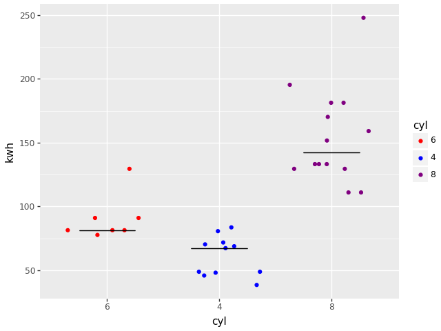

==============
dppd_plotnine
==============

Welcome to **dppd_plotnine**, which 
converts `plotnine <https://plotnine.readthedocs.io/en/stable>`_ to  
work with `dppd <https://dppd.readthedocs.io/en/latest/>`_ and pythonifies it's api.

It's source lives at `github <https://github.com/TyberiusPrime/dppd_plotnine>`_.

Quickstart
==========

::

   import numpy as np
   from dppd import dppd
   import dppd_plotnine
   from plotnine.data import mtcars
   import plotnine as p9
   dp, X = dppd()

   plot = (
      dp(mtcars)
      .assign(kwh=X.hp * 0.74)
      .categorize("cyl")
      .p9()
      .add_point(
            "cyl",
            "kwh",
            color="cyl",
            position=p9.position_jitter(height=0, random_state=500),
      )
      .add_errorbar(
            x="cyl",
            y="kwh_median",
            ymin="kwh_median",
            ymax="kwh_median",
            data=dp(X.data)
            .groupby("cyl")
            .summarize(("kwh", np.median, "kwh_median"))
            .pd,
      )
      .scale_color_manual(
            ["red", "blue", "purple"]
      )  # after pd, X is what it was before
      .pd
    )
    plot.save("test.png")
    

dppd_plotnine supports two different call conventions,
one matching plotnine (and ggplot) and another, perhaps
more convinient one, see `call convention <aes.html>`_.

Contents
========

.. toctree::
   :maxdepth: 2

   Call convention / changes from plotnine. <aes.md>

   License <license>
   Authors <authors>
   Changelog <changelog>
   Module Reference <api/modules>

Indices and tables
==================

* :ref:`genindex`
* :ref:`modindex`
* :ref:`search`

.. _toctree: http://www.sphinx-doc.org/en/master/usage/restructuredtext/directives.html
.. _reStructuredText: http://www.sphinx-doc.org/en/master/usage/restructuredtext/basics.html
.. _references: http://www.sphinx-doc.org/en/stable/markup/inline.html
.. _Python domain syntax: http://sphinx-doc.org/domains.html#the-python-domain
.. _Sphinx: http://www.sphinx-doc.org/
.. _Python: http://docs.python.org/
.. _Numpy: http://docs.scipy.org/doc/numpy
.. _SciPy: http://docs.scipy.org/doc/scipy/reference/
.. _matplotlib: https://matplotlib.org/contents.html#
.. _Pandas: http://pandas.pydata.org/pandas-docs/stable
.. _Scikit-Learn: http://scikit-learn.org/stable
.. _autodoc: http://www.sphinx-doc.org/en/stable/ext/autodoc.html
.. _Google style: https://github.com/google/styleguide/blob/gh-pages/pyguide.md#38-comments-and-docstrings
.. _NumPy style: https://numpydoc.readthedocs.io/en/latest/format.html
.. _classical style: http://www.sphinx-doc.org/en/stable/domains.html#info-field-lists
